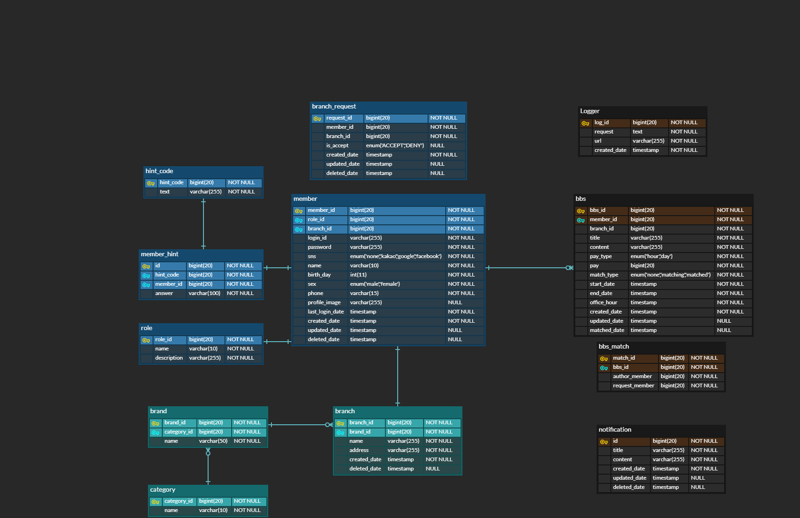

# docs

개발에 관한 문서 정리 repo입니다.

# 목차
1. [시나리오](./Scenario.md)
2. [요구사항](./Requirement.md) 
4. 화면 설계  
    4 - 1. 스케치  
    4 - 2. 디자인  
5. 시스템 설계  
    5 - 1. DB 설계  
    
    5 - 2. 시스템 구조  
    

  

6. [Restful API 설계](./RestAPIList.md)
